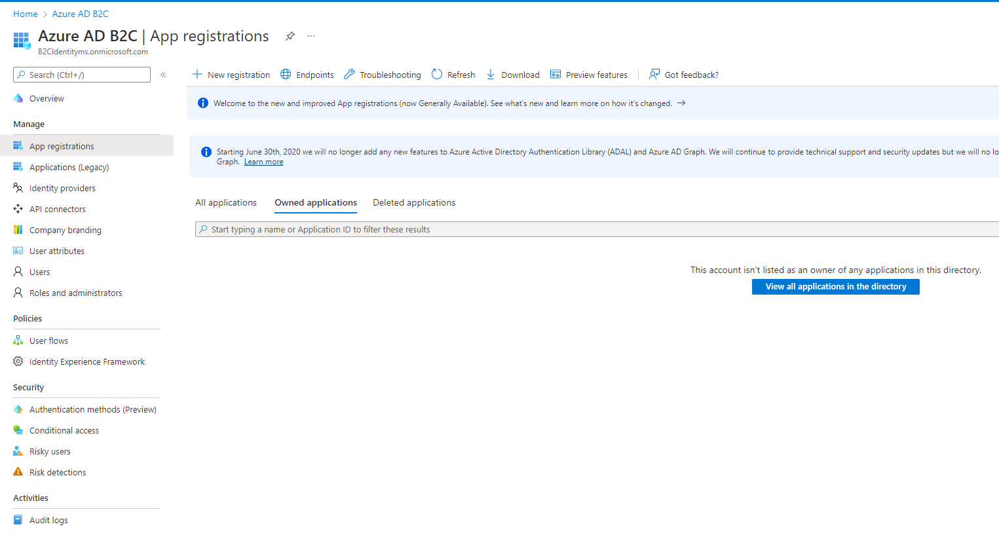
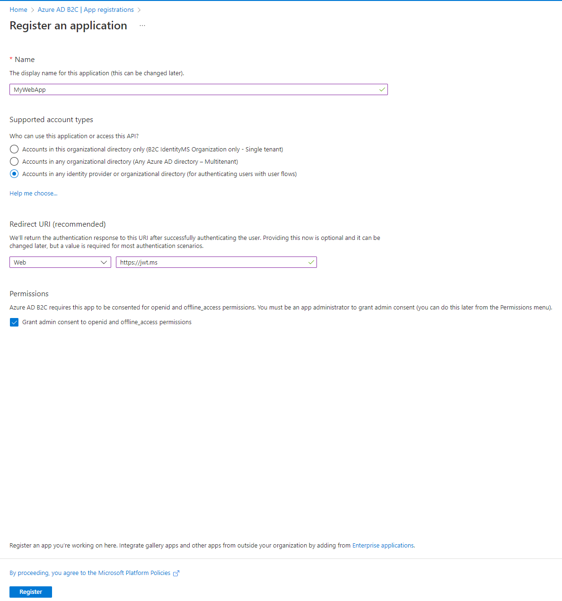
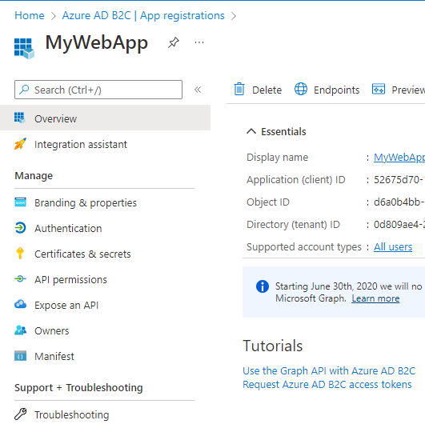
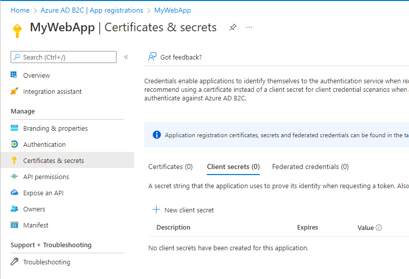
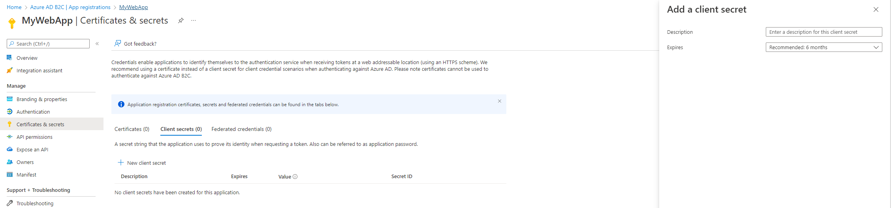
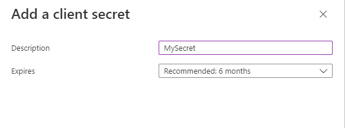
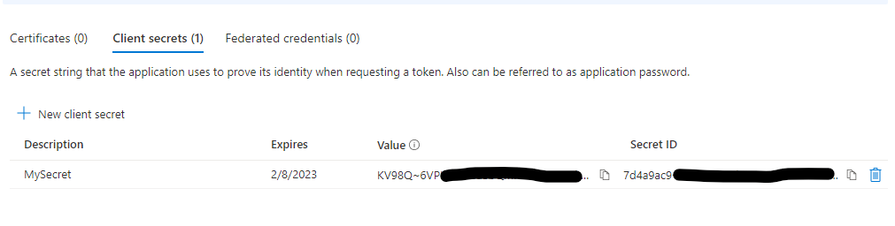
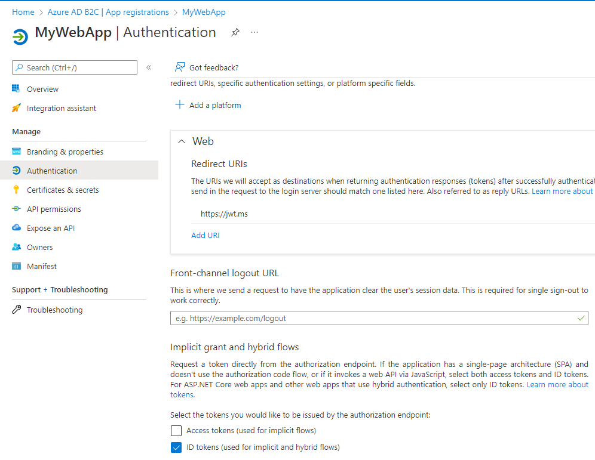

# Register a web application

## Register a application
Go in your Azure AD B2C directory and click on "App registrations".

## Enter all informations
- Enter the name of your app
- Select the third option
- Under "Redirect URI", select "Web" and enter the URL of your app
- Click on "Register"

## Create a client secret
In your app, go to "Certificates & secrets".

- Click on "New client secret" to create a new one.

- Enter the name of your secret and define the expiration. Please do not select more than 12 months.

- keep the secret value in a vault. We will use it later.

## Enable ID token
For this app, it's required to enable "ID tokens".

# Disclaimer
See [DISCLAIMER](./DISCLAIMER.md).