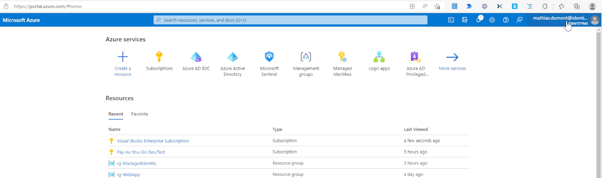
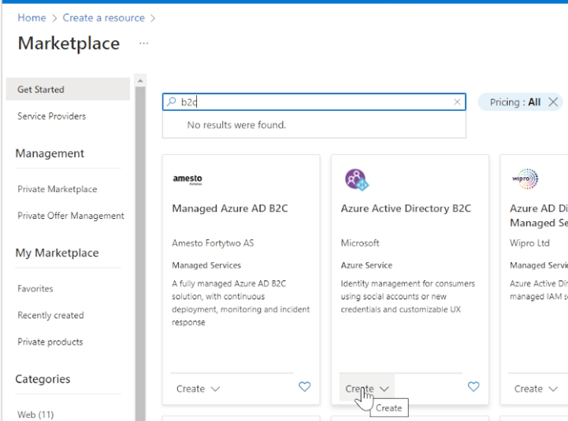
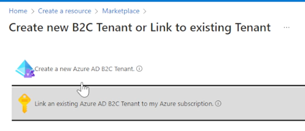
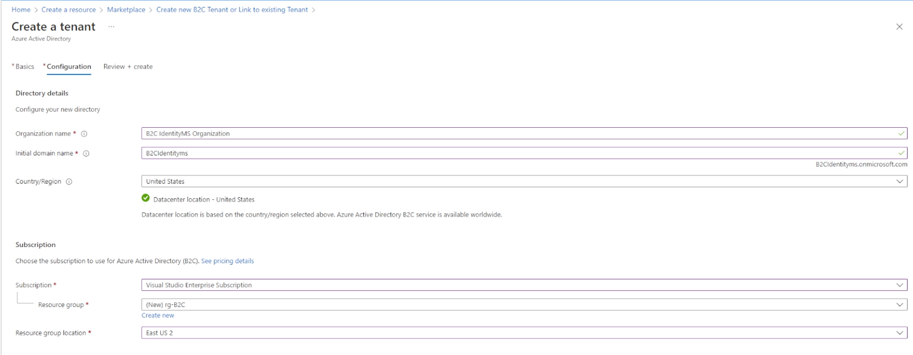
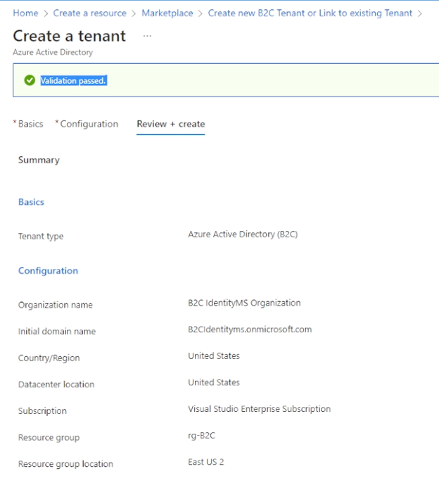
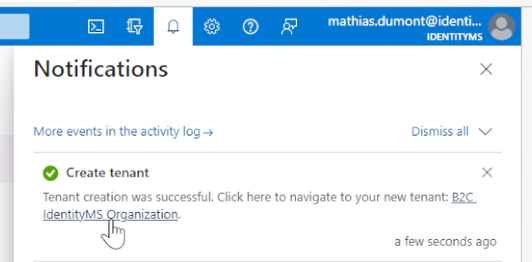
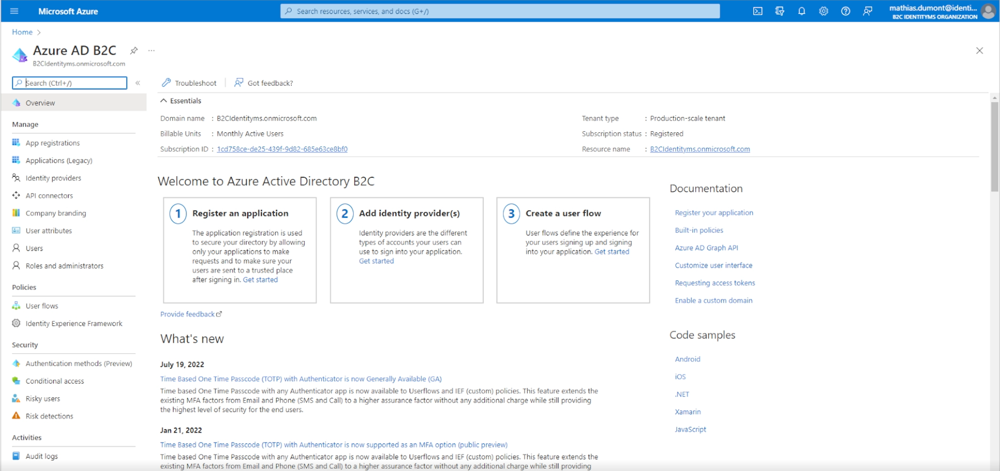

# Create an Azure AD B2C tenant

## Create a resource in your primary directory

## Enter "B2C" and create

## Select "new azure AD B2C tenant"

## Enter all informations
* create a resource group that will store your B2C tenant

## If validation passed, click on Create

## When it will be created, click on the link

## Welcome in your B2C tenant 

# Disclaimer
See [DISCLAIMER](./DISCLAIMER.md).