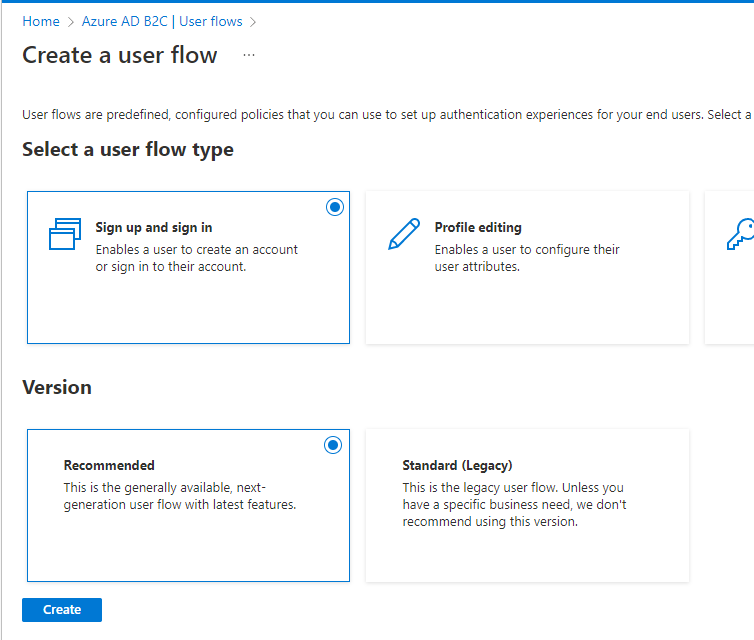

# User flows

## Sign-up and sign-in
Go to "User flows" and click on "New user flow".

### Select "Sign up and sign in" option and select "recommended"

### Enter all informations
- Name
- Identity providers
- MFA
- Conditional Access
- User attributes. You can click on "Show more" to see all attributes.

### Test
Click on your user flow created previously ("B2C_1_Default_signup_signin")

Click on "Run user flow"

Click on "sign up now"

Enter your email and click on "Send verification code"

You will receive a code through email you should put in this form.

Now your email address is verified so you can create your account.

## Profile editing

## Password reset

# Disclaimer
See [DISCLAIMER](./DISCLAIMER.md).